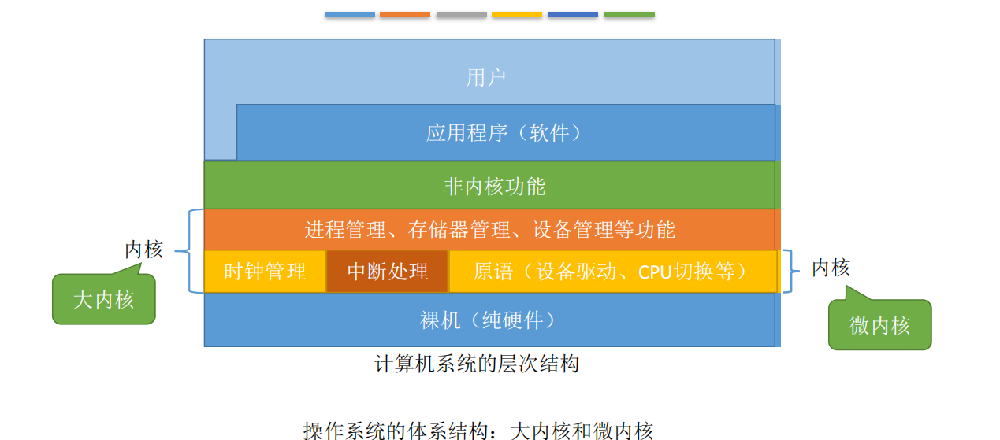
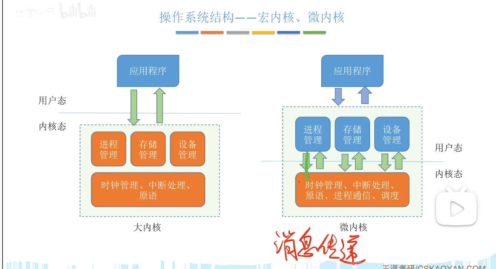
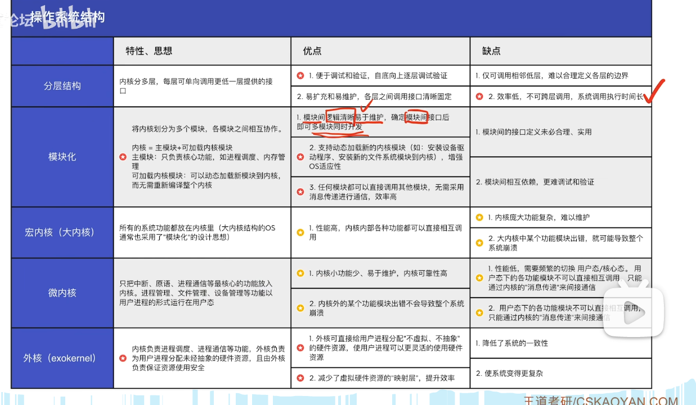
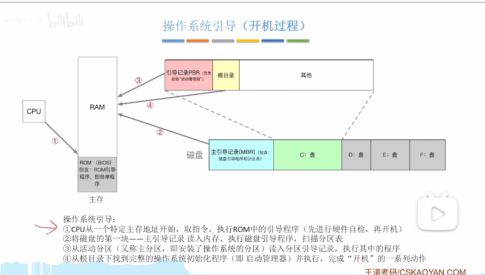
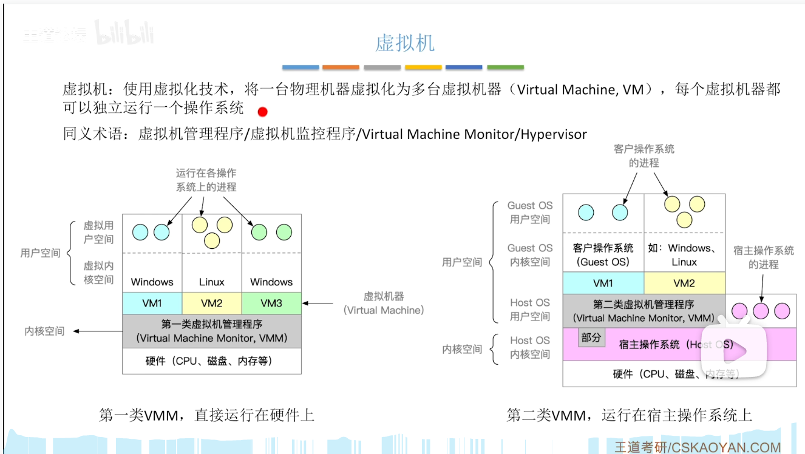
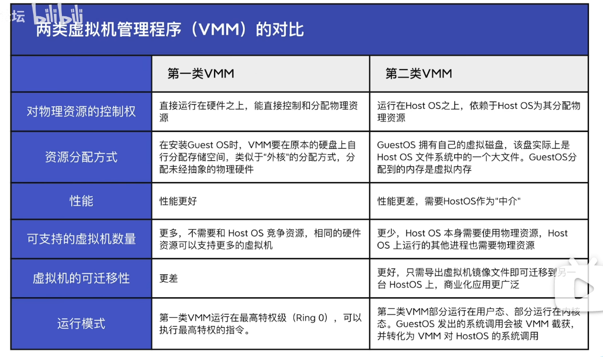

# 计算机系统概述

### （一）os基本概念

- ##### 硬件与用户的中介

- ##### os特征：（前2基本）

  - 并发
  - 共享
    - 互斥
    - 同时
  - 虚拟
  - 异步（进程间执行先后顺序未知）

- ##### 目标（功能）

  - 计算机资源管理
    - 处理机管理
      - 进程控制，进程同步，进程通信，死锁处理，处理机调度
    - 存储器管理
      - 内存分配与回收，地址映射，内存保护与共享，内存扩充
    - 文件管理
      - 空间管理，读写管理，保护，目录管理
    - 设备管理
      - I/O请求
      - 缓冲管理，设备分配，设备处理，虚拟设备
  - 用户与硬件接口
    - 命令接口
      - 联机（交互：shell）
      - 脱机（批处理：shell脚本）
    - 程序接口：系统调用（广义命令）
  - 计算机资源“扩充”

### （二）操作系统发展历程

1. ##### 手工处理

2. ##### 批处理

   - 单道
   - 多道（并发出现）

3. ##### 分时：同时，交互，独立，及时

4. ##### 实时：及时，可靠

   - 硬实时
   - 软实时

5. ##### 网络操作系统，分布式操作系统

6. ##### 个人操作系统

### （三）程序运行环境

1. ##### cpu运行模式

   - 用户态（目态）
   - 核心态（管态）
   - 用户态到核心态切换由==硬件==完成
   - 内核管理
     - 时钟管理
       - 注意读时钟不算在核心态中
       - 时钟中断
     - 中断机制
     - 原语（类似于db事务）
     - 系统控制数据结构及处理（进程，存储器，设备）

2. ##### 中断与异常处理

   - 中断和异常
     - 中断（外）跟cpu无关，
       - 时钟，设备
     - 异常（内）跟cpu相关
       - 非法操作，地址越界，溢出，缺页
       - 不能屏蔽
       - 分类：fault，trap，abort
     - 软件中断
     - 硬件中断
     - 处理过程

   - 系统调用（INT）
     - 应用程序可以通过系统调用来请求获得操作系统内核的服务

3. ##### 程序的链接与装入

   - 内存映像
   - 地址空间

4. ##### 操作系统结构

   - 分层
   - 模块化
   - 宏内核
   - 微内核
   - 
   - 外核
   - 

### （四）操作系统引导（启动）

1. 激活cpu ：读rom中boot程序，PC设为BIOS，执行
2. 硬件自检
3. 加载系统盘
4. 加载主引导记录MBR（告诉cpu去哪个硬盘）
5. 扫描硬盘分区表，加载活动分区（放os的磁盘分区）
6. 加载分区引导记录PBR
7. 加载启动管理器
8. 加载os
9. 

### （五）虚拟机

1. 第一类虚拟机
2. 第二类虚拟机
3. 

区别：

- 虚拟机管理程序在用户空间还是在内核空间

- 内存是物理还是虚拟

