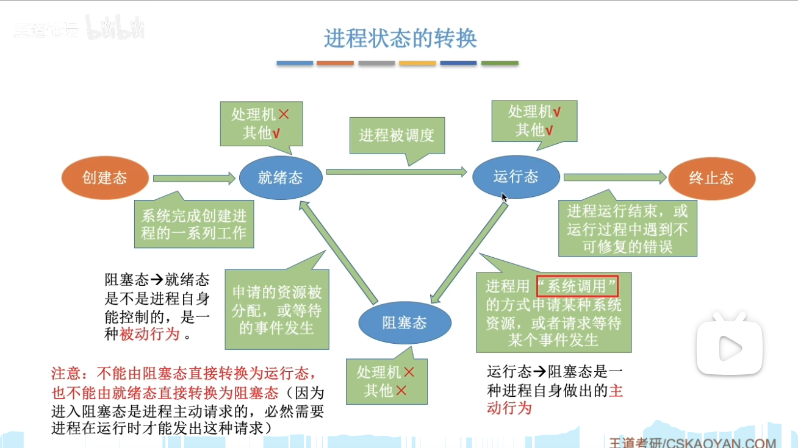
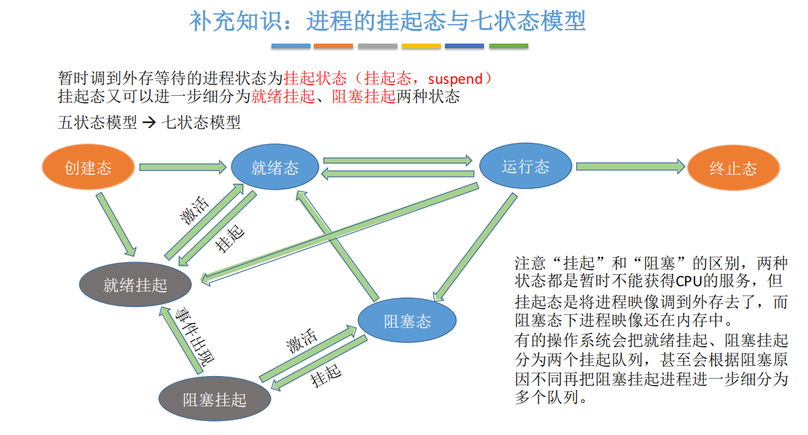

# 进程与线程

（一）进程与线程

1. 进程
   - 进程的概念
     - 间断性，不可再现性
     - 进程映像：程序段，数据段，PCB
     - 进程定义：运行过程，资源分配单位（调度单位：线程）  
   - 进程的特征
     - 动态
     - 并发
     - 独立
     - 异步
   - 进程状态
     - 运行
     - 就绪
     - 阻塞
     - 创建
     - 终止
     - 
   - 进程的组成
     - PCB
     - 数据段
     - 程序段
   - 进程的控制
     - 创建
     - 终止
     - 阻塞和唤醒（*）
   - 进程的通信
     - 共享存储
     - 消息传递
       - 直接
       - 间接：信箱
     - 管道（本质是文件）*
2. 线程
   - 用户级线程（ULT）
     - 只能用一个cpu
   - 内核级线程（KLT）
     - 可用多个cpu
   - 一对一，一对多，组合方式
     - 线程切换可能会引起进程切换
3. 进程线程的组织与控制
4. 进程间通信

（二）cpu调度与上下文切换

1. 调度基本概念
   1. 基本概念：选择！！
   2. 层次：
      - 高级调度：作业
        - 按一定的原则从外存的作业后备队列中挑选一个作业调入内存
        - 并创建进程。
        - 每个作业只调入一次，调出一次。
        - 作业调入时会建立==PCB==，调出时才撤销PCB。
      - 中级调度：内存
        - 暂时调到外存等待的进程状态为==挂起状态==。
        - 被挂起的进程==PCB==会被组织成==挂起队列==（PCB在内存）
        - 
      - 低级调度：进程
        - 不出内存 所以很多 也很快
2. 调度的目标（计算）
   - cpu利用率 ： 有效/有效+空闲
   - 系统吞吐量：单位时间完成作业数量
   - 周转时间：作业完成 - 作业提交时间
   - 等待时间：不在运行就是等待！
   - 响应时间：提交**请求**到首次**相应**
   - 响应比：等待时间+ 要求服务时间 / 要求服务时间
3. 调度的实现
   - 调度程序
     - 排队器
     - 分派器
     - 上下文切换器
   - 调度时机
     - 不能调度
       - 处理中断
       - 进程在操作系统**内核临界区**
       - 原子操作
   - 调度方式
     - 抢占式
     - 非抢占式
   - 闲逛进程（充数的，保证一直有人给他调度）
   - 线程调度
     - 用户级：进程控制
     - 内核级：os控制
4. 调度算法
   - 先来先服务（FCFS）
   - 短作业优先（SJF）
   - 优先级调度
     - 抢占式
     - 非抢占式
     - 静态优先级
     - 动态优先级
   - 高响应比优先调度算法（*）
   - 时间片轮转（分时）
   - 多级队列调度（*）
   - 多级反馈队列调度（*）
5. 上下文切换机制
   - 挂起进程，保存cpu上下文，寄存器
   - 更新PCB
   - 将PCB移入队列
   - 选择另一个进程，更新PCB
   - PC跳转
   - 恢复上下文

（三）同步与互斥

1. 基本概念
   - 临界资源
     - 临界区：访问临界资源的代码
   - 同步
   - 互斥：**同步机制**四个原则
     - 空闲让进
     - 忙则等待
     - 有限等待
     - 让权等待
2. 互斥实现方法
   - 硬件：
     - 中断屏蔽：把门焊死不让进
     - 硬件指令：PV操作（P是先改后看，V可以唤醒+1）
       - swap
       - testandset：不满足让权
   - 软件：引入标志！
     - 单标志（turn，让出去了可能拿不回来）
     - 双标志先检查（flag[]，先看再改）
     - 双标志后检查（flag[]，先改再看）
     - Peterson（flag[]+turn,只有一个人有turn）
3. 锁
   - 信号量
     - 整型（只有S）
     - 记录型（有队列可唤醒）
     - 实现同步（先V后P，S=0）
     - 实现互斥（先P后V，S=1）
     - 实现前驱（DAG）：一条边一对PV
     - 方法论
   - 管程
     - 组成：名称，内部数据结构，过程（函数），初始化语句 （这不就是类吗？）
     - 条件变量：（类比信号量）
       - 相同：可唤醒/阻塞
       - 不同：条件变量没有值，值在共**享数据结构**中
     - 进程互斥（只让一个人进）
4. 经典同步问题：（*）
   - 生产者-消费者
     - mutex（互斥访问）
     - full（满：先取后放）
     - empty（空：先放后取）
     - V P是可以**引起**事件的
   - 读者写者
   - 哲学家进餐
   - 吸烟者
   - 一般都是判断信号量S的值域

（四）死锁

1. 基本概念
   - 定义
   - 原因
     - 系统资源竞争
     - 进程推进顺序非法
   - 必要条件
     - 互斥
     - 不剥夺
     - 请求并保持
     - 循环等待
2. 死锁预防
   - 破坏以上四个必要条件
3. 死锁避免
   - 系统安全状态
   - 银行家算法
4. 死锁检测
   - 资源分配图
     - 圆圈代表进程，框代表资源
     - 请求边（进程到资源），分配边（资源到进程）
   - 死锁定理：资源分配图无法**简化**（*）
     - 简化：消去图中所有边
5. 死锁解除
   - 资源剥夺法
   - 撤销进程法
   - 进程回退法