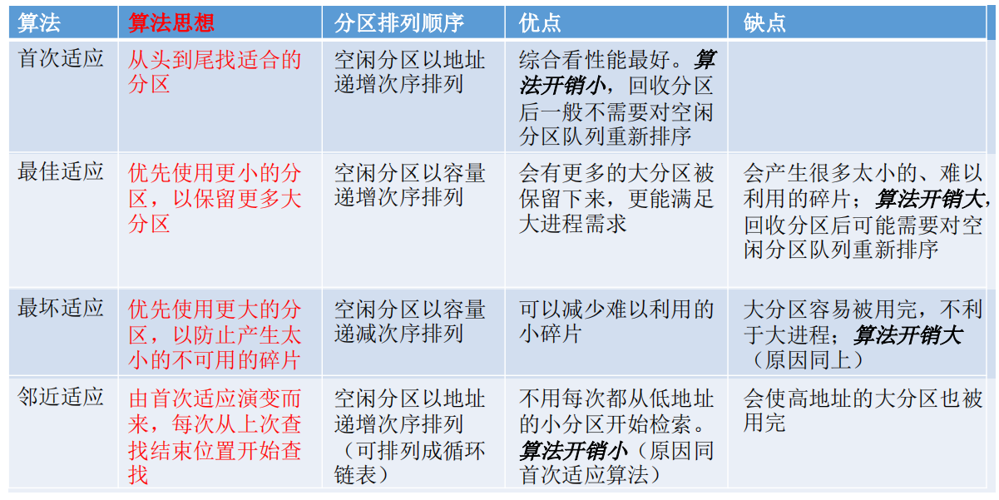
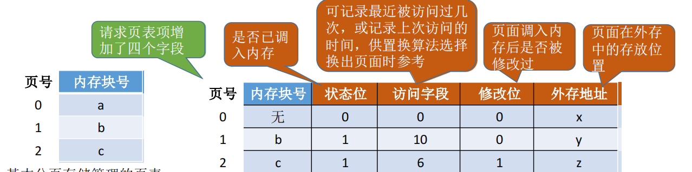

# 内存管理

（一）内存管理基础

1. 基本概念：

   - 主要功能
     - 空间分配与回收
     - 地址转换
     - 内存空间扩充
     - 内存共享
     - 存储保护
   - 链接（在一起）
     - 静态链接 
     - 装入时动态链接
     - 运行时动态链接
   - 装入（搬家）
     - 绝对装入
     - 可重定位装入
     - 动态运行时装入

   - 逻辑地址与物理地址
   - 地址变换（计算*）
   - 内存共享
   - 内存保护
   - 内存分配与回收

2. 内存分配管理：

   - 连续分配管理
     - 单一连续分配：独占用户区，有内部碎片
     - 固定分区分配：
       - 分区大小相等
       - 分区大小不等
     - 动态分区分配
       - 首次适应：从头开始
       - 临近适应：从上次结束的地方开始
       - 最佳适应：容量sort 从小到大
       - 最坏适应：容量sort 从大到小
       - 

   - 页式管理
     - 以页位单位（2的整次幂字节）分，只有页内碎片
     - 地址结构页号+页内偏移量
     - 页表，二级页表？？？ **谁在一级？**
     - ==地址变换结构==
     - 快表（TLB）：不在内存，高速缓冲寄存器
   - 段式管理
     - 分段：段号+段内偏移
     - 段表
     - ==地址变换结构==
     - 段的共享（可重入代码：不可修改，不属于临界资源）
     - 好处：方便编程，信息保护和共享，动态增长，动态链接
   - 段页式管理
     - 段号+页号+页内偏移
     - ==地址变换结构==
   - **地址变换都可以理解成换装！**
   - **地址空间的一维二维？**
   - **段页式的TLB？？**
   - **分段与动态分区的区别？**

（二）虚拟内存管理

1. 基本概念：

   - 传统存储管理方式：一次性，驻留性
   - 虚拟存储：多次性，对换性，虚拟性
   - 局部性原理：时间局部性，空间局部性
   - 实现：内外存，页表，中断，地址变换机构

   - 请求页式管理：
     - 页表：
     - 缺页中断：内部异常
     - 地址变换：先查快表，再查内存，再查外存，最后还是要写到快表，然后再查一次
   - 页框分配
     - 驻留集大小
     - 内存分配策略
       - 固定分配 局部置换 （一开始分好物理块数量，换页只能找自己人）
       - 可变分配 全局置换（一开始分好，但是可以增加减少，换页可以找系统空闲）
       - 可变分配 全局置换（可以增加减少，但是换页只能找自己人）
     - 物理块调入算法：平均分配，按比例分配，优先权分配
     - 调入页面时机：预调页（多）+请求调页（一个）
     - 从何处调入：**对换区**+文件区
     - 如何调入
   - 页置换算法
     - 最佳置换算法（OPT）
     - 先进先出（FIFO）
     - 最近最久未使用（LRU）
     - 时钟置换算法（CLOCK）
       - 简单版：只有一个访问位
         - 扫一遍 将1置0
       - 改进版：访问位+修改位 （访问 > 修改）
         - 第一遍：找（0，0）
         - 第二遍：找（0，1）改访问位
         - 第三遍：找（0，0）
         - 第四遍：找（0， 1）
   - 抖动：刚被调走又要招回
   - 工作集：滑动窗口？滑动set！定长找不同类个数

2. 内存映射文件（*）

3. 虚拟存储器性能：缺页率

4. 地址翻译（*）

页缓冲队列：调出的页不写回硬盘先。