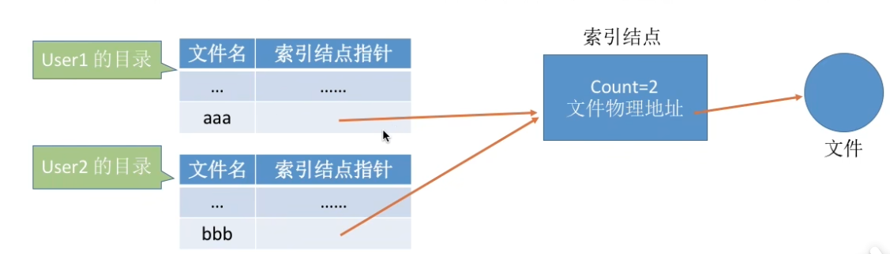

# 文件管理

（一）文件：

1. 基本概念
   - 文件元数据（文件属性）：相关信息：所有者，创建时间
   - 文件控制块（FCB） --- 文件目录项 --- 文件目录（文件名+索引节点/FCB）
   - 索引节点：替代FCB放到文件目录中
     - 磁盘索引：
     - 内存索引：文件打开时 磁盘索引会复制一份放到内存中
   - FCB/索引节点就相当于图书管索书号
   - 文件目录一般在磁盘上
   - 数据项 --- 记录 --- 文件
2. 文件操作
   - 建立：外存空间+目录项
   - 删除
   - 打开
   - 关闭
   - 读
   - 写
3. 文件保护（*）
4. 文件逻辑结构
   - 流式文件（无结构）
   - 有结构：
     - 顺序
     - 索引
     - 索引顺序：组内有序
     - 直接文件（散列文件）（*）
5. 文件物理结构
   - 连续分配
   - 链接分配
     - 隐式：下一条放磁盘块中，访问了一个才能访问下一个
     - 显式：引入FAT放一个磁盘块中，像数组模拟邻接表一样，最后一个是-1，空闲块用 -2 表示
   - 索引分配
     - 加入索引块，放目录
     - 多层索引
     - 混合索引
       - 直接地址
       - 间接地址
       - 二级间接地址

（二）目录：

1. 基本概念
   - FCB/索引节点的有序集合
2. 目录结构
   - 单级目录
   - 两级目录
   - 树形目录
   - 无环图目录：操作共享节点
3. 目录操作
4. 文件共享
   - 硬链接：如果count>0只删目录项
   - 
   - 软链接（快捷方式）：给个地址让你自己去找，可以被删
   - 

（三）文件系统：

1. 全局结构
2. 外存结构
3. 内存结构
4. 外存空闲空间管理
   - 空闲表法（第一个空盘块，盘块数）
   - 空闲链表法
     - 盘块
     - 盘区
   - 位示图法
   - 成组链接（超级块）：先分超级块，分完让下一级取缔超级块
   - 
   - FAT也可以管理（*）
   - **分配与回收**
5. 虚拟文件系统
6. 文件系统挂载

安全管理级别？？

逻辑结构会放物理地址吗？

逻辑地址在哪（目录没有？）

打开文件表？？

树形目录的索引节点？索引结构？