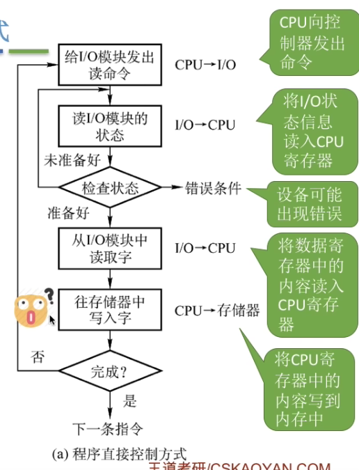
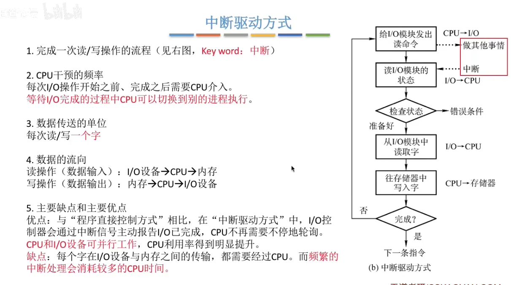
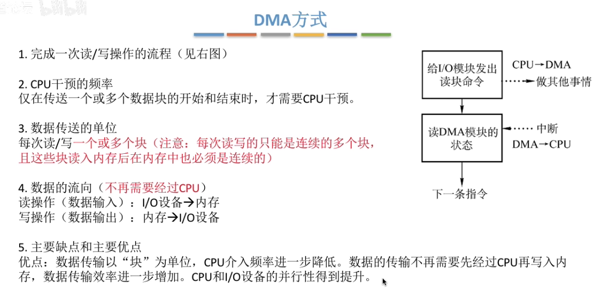
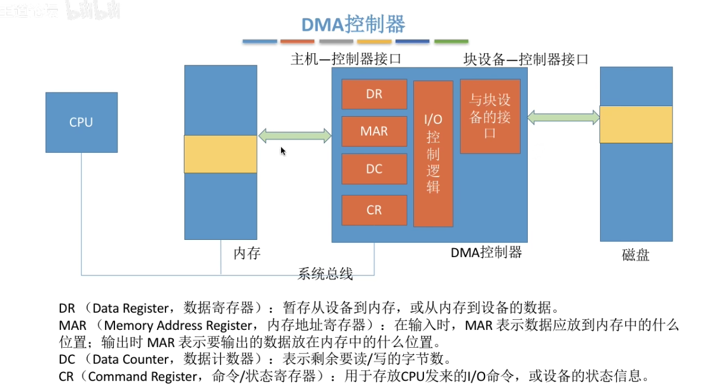
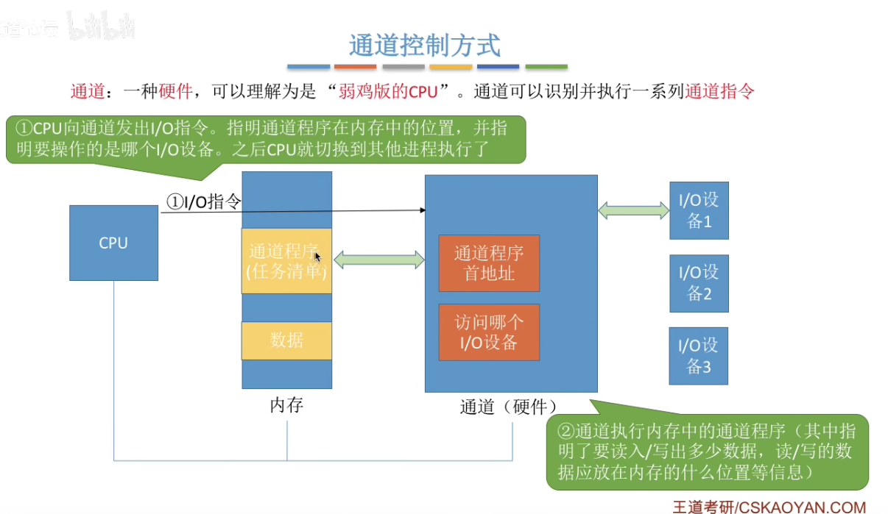
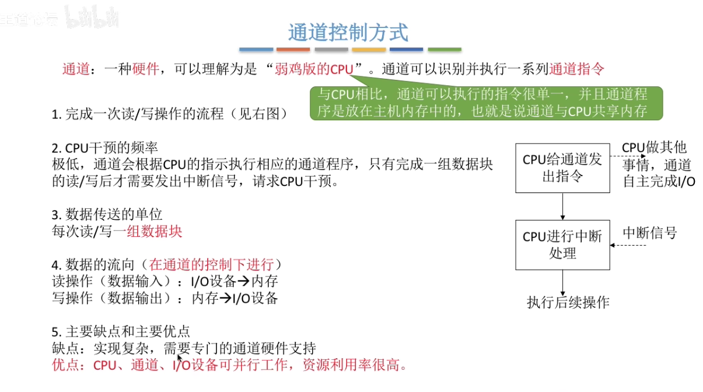
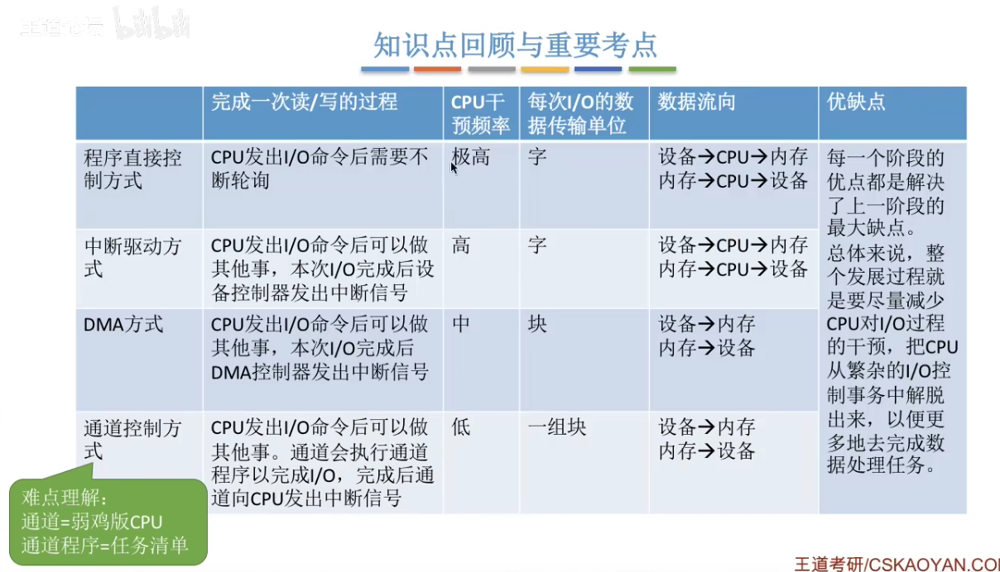
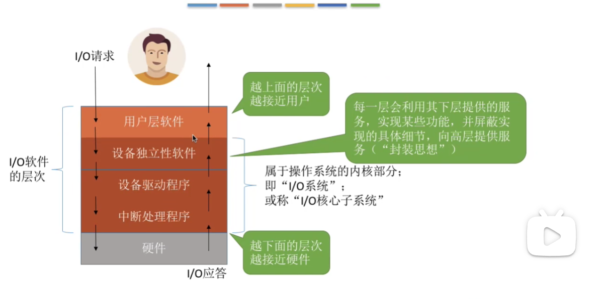
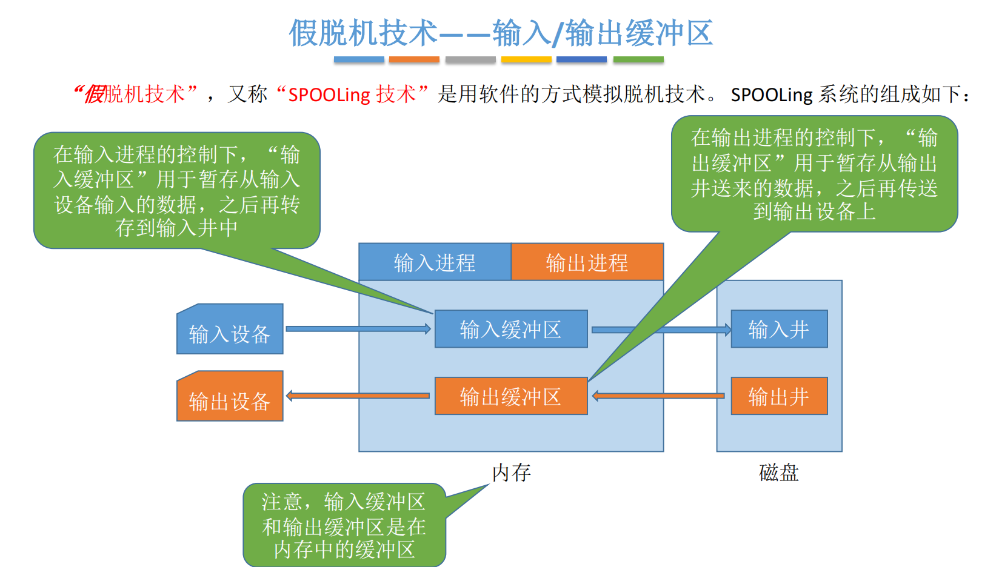
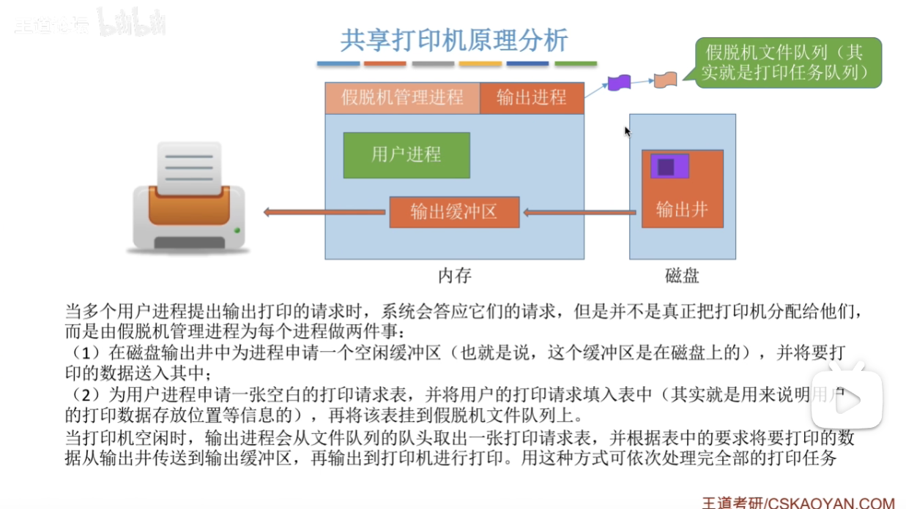

# I/O管理

（一）IO管理基础：

设备：

1. 设备的基本概念：
2. 设备分类：
   - 字符设备、块设备
   - 高速、中速、低速
3. IO接口：（设备控制器）
   - 跟cpu连
   - 跟IO设备连
4. IO端口：
   - IO设备能被CPU直接访问的寄存器
     - 数据寄存器
     - 状态寄存器
     - 控制寄存器
     - 独立编址/统一编址

IO控制方式：（*）

1. 程序直接控制（轮询）：（cpu盲等）

   - 注意是数据流先从io --- cpu -- 内存

   - 

2. 中断驱动：

   - cpu在指令周期末尾检查中断
   - 中断需要时间开销
   - 

1. DMA：
   - DMA也是一个字一个字读入内存的，无需cpu干预，但是读完**连续的多个块**再通过中断告诉cpu
   - 
   - 
2. 通道控制：
   - 把通道能识别的指令放到内存当中，让通道自己干
   - 通道是一种硬件，他可以译码
   - 一个通道可以控制多个IO控制器，一个IO控制器课可以对应多个设备
   - 
   - 
   - 

IO软件层次结构：（*）

1. 用户层IO软件 
2. 设备独立性软件
   1. **LUT：逻辑设备表**，可以一个系统一张，也可以一个用户一张
3. 设备驱动程序
   1. 独立进程形式存在
   2. 一类设备一台？？？
4. 中断处理程序
5. 硬件

应用程序IO接口

1. 字符设备接口
2. 块设备接口
3. 网络设备接口
4. 阻塞/非阻塞IO 一般都是阻塞IO

（二）设备独立性软件：

- 缓冲区管理：（*）
  - 单缓冲
  - 双缓冲
  - 循环缓冲
  - 缓冲池
  
- 设备分配与回收：
  - 概述
    - 独占设备
    
    - 分时共享设备（并发）
    - spooling：实际上是独占，但是可以视作共享
    
  - 数据结构
  
    - **设备**控制表（DCT）
    - **控制器**控制表（COCT）
    - **通道**控制表（CHCT）
    - **系统**设备表（SDT）：一个系统只有一张
    - SDT与LUT的联系？
  
  - 策略
  
    - 原则：效率，死锁，用户与设备隔离
    - 方式：
      - 静态：主要是独占设备，一次性全部分配
      - 动态：运行时根据啥啥分配
  
  - 安全性
  
  - 逻辑设备名到物理设备名映射
  
- 假脱机技术（SPOOLing）：（*）

  - 软件实现
  - 
  - 

- 设备驱动程序接口

（三）外存：

- 磁盘
  - 地址：柱面号-盘面号-扇区号
  - 理解盘块号递增的结构
  - 磁盘初始化（*）
    - 低级格式化
    - 高级格式化
    - 引导块
    - 坏块
  - 磁盘调度算法
    - 读块时间：**寻道时间**+旋转延迟+传输时间
    - 先来先服务（FCFS）
    - 最短寻道时间优先（SSTF）
    - 扫描算法（SCAN）--LOOK（触底）
    - 循环扫描（C-SCAN）--C-LOOK    （没人就掉头）           
    - 算法间的比较                                                                                                                                                                                                                                                                                                                                                                                                                                                                                                                                                                                                                                                                                                                                                                                                                                                                                                                                                                                                                                                                                                                                                                                                                                                                                                        
- 固态硬盘
  - 读？写？以页为单位（对应磁盘块）
  - 改？以块为单位擦
  - 负载均衡
    - 动态：每次选擦写少的
    - 静态：将擦写少（读的多）的放入擦写多的块

> 驱动程序一类设备一台？

> 什么时候scan会变look?

未完成：最后两章的所有选择题，缓冲区大题，资源分配图精解。