# 绪论 

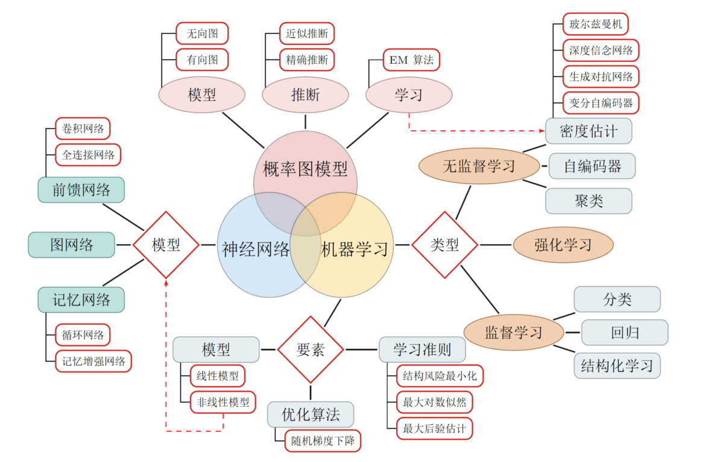

机器学习？

表示学习？

深度学习？

- 通过构建具有一定“**深度**”的模型，可以让模型来**自动学习好的特征表示**（从底层特征，到中层特征，再到高层特征），从而最终提升预测或识别的准确性

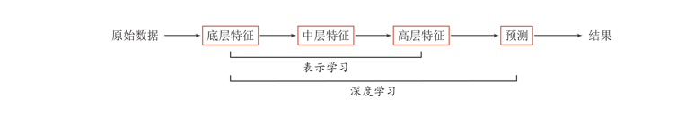

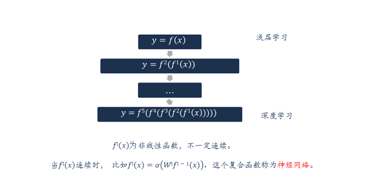

暂且理解为复合函数 输入 -- >> 深度学习（复合函数）-- >> 输出

神经网络？

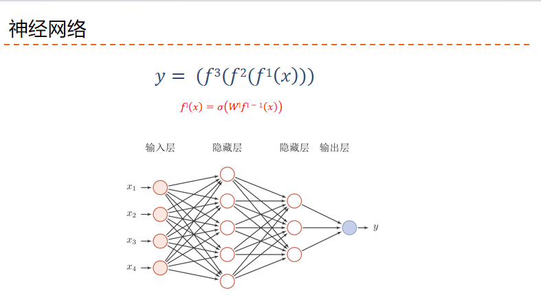

一种特殊的复合函数：注意x，y都是向量

# 机器学习概述

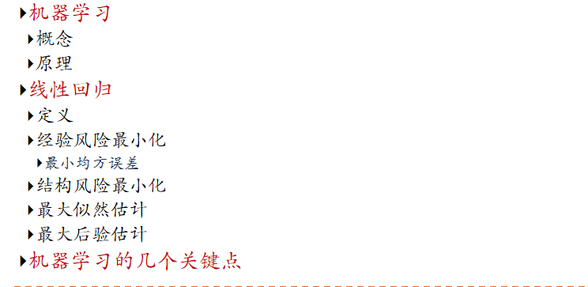

机器学习？

- 机器学习：通过算法使得机器能从大量数据中**学习规律**从而对**新**的样本**做决策。**

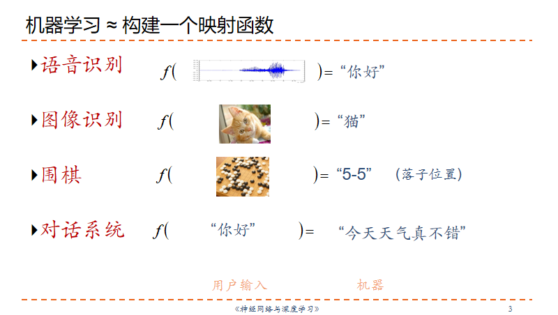

## 机器学习三要素：

- 模型
  - 模型暂时可以理解成 ==程序==  你给输入他给输出 
  - 可能是函数，可能是自动机。
- 学习准则
  - 损失函数
    - 衡量预测结果与实际结果的差异
  - 期望风险
    - 所有数据的情况，但是不知道概率分布，所以无法衡量
  - 经验风险
    - 用数据集上的分布来估计（大数定律）
    - 让经验风险最小（让训练集的平均损失最小）：转化为==最优化问题==
  - 已经确定目标！大胆向前吧！！
- 优化
  - 梯度下降法（经验风险是一个连续可导函数）
    - 梯度，步长（学习率）
    - 随机梯度下降法：一个人的损失函数就是所有
    - mini-batch随机梯度下降法：小组损失函数取平均
    - 验证集不在降就要停（不然过拟合）
  - 泛化错误
    - 训练集跟实际情况还是有差异滴！
    - 引入正则化！不让他太靠近训练结果（经验风险）
    - 正则化？ 损害优化！
      - 加约束
      - 干扰优化
  - 提前停止

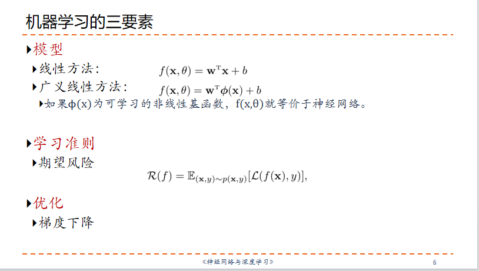

### 机器学习问题：

- 回归（预测值：连续）
- 分类（预测值：离散）
- 聚类

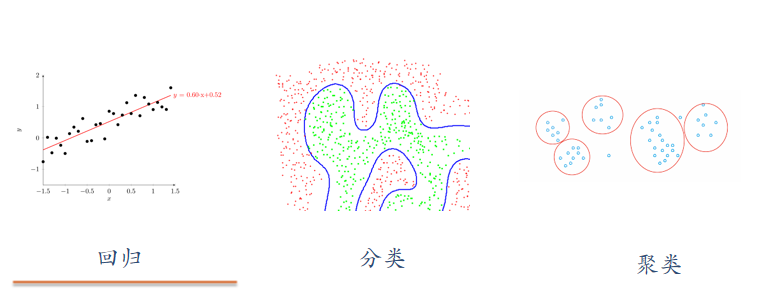

## 线性回归

#### 最小二乘法

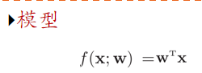

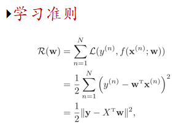

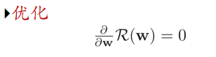

#### 岭回归

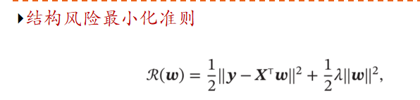

==不太理解这里的正则化项==

#### 最大似然估计

似然？先验？后验？

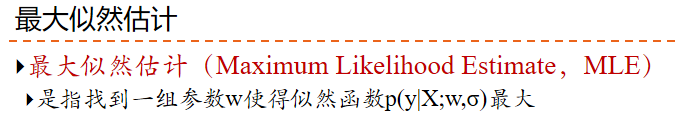

#### 最大后验估计

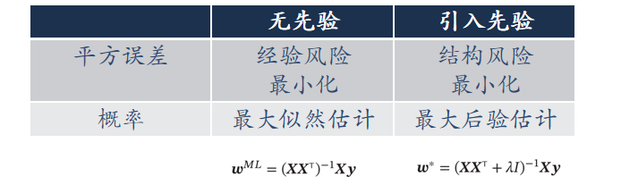

在最大似然估计加入先验 结构经验最小化

#### 多项式回归

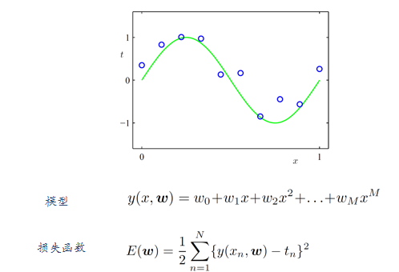

机器学习分类：

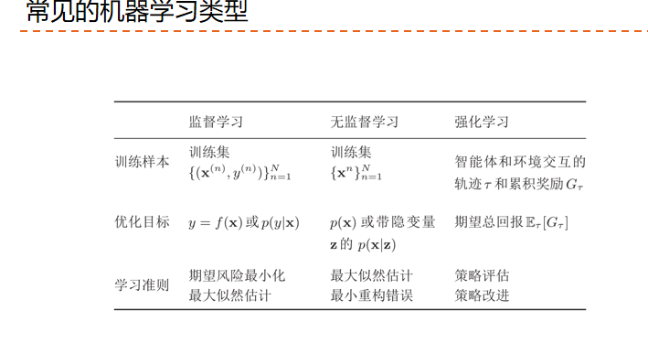

模型选择：控制模型复杂度

偏差与方差：过拟合偏差大，欠拟合方差大

PAC学习？样本复杂度？：用来评价你的样本数据行不行

- PAC学习（Probably Approximately Correct  Learning）是一种在计算机科学和统计学中用于**量化学习算法性能**的框架。由Leslie  Valiant在1984年提出，PAC学习框架提供了一种方式来评估学习算法在学习任务上的有效性，特别是在有限的样本情况下如何能够获得近似正确的模型。这个概念主要应用于机器学习领域，特别是在监督学习中。

- 如果固定ϵ,δ，可以反过来计算出样本复杂度
- PAC学习理论可以帮助**分析一个机器学习方法在什么条件**下可以学习到一个近似正确的分类器。
- 如果希望模型的假设空间越大，泛化错误越小，其需要的样本数量越多。

### 常用定理：

没有免费午餐定理（No Free Lunch Theorem，NFL）：

- 对于基于迭代的最优化算法，**不存在**某种算法**对所有问题**（有限的搜索空间内）都有效。如果一个算法对某些问题有效，那么它一定在另外一些问题上比纯随机搜索算法更差。
- 意思就是局部有效

丑小鸭定理(Ugly Duckling Theorem)：

- 丑小鸭定理揭示了模式识别中的一个基本问题，即没有**通用的、客观的相似度度量标准**。这个概念促使我们在面对分**类和识别**问题时，深入思考如何**选择和定义**用于比较和分析的**特征**。

奥卡姆剃刀原理(Occam's Razor)：

- 如无必要，勿增实体

归纳偏置(Inductive Bias)：

- 很多学习算法经常会对学习的问题做一些**假设**，这些假设就称为归纳偏置。

- 归纳偏置在贝叶斯学习中也经常称为先验（Prior）。

  

# 线性模型

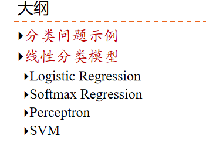

#### Logistic Regression

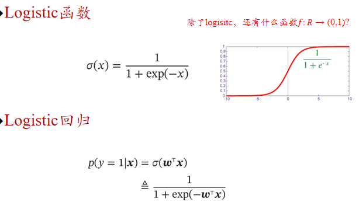

**将分类问题看作条件概率估计问题**

在样本条件，你是xx的概率是多少

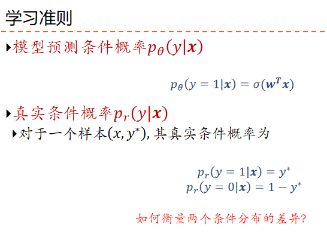

引入==交叉熵==来衡量模型测得的分布和真实分布

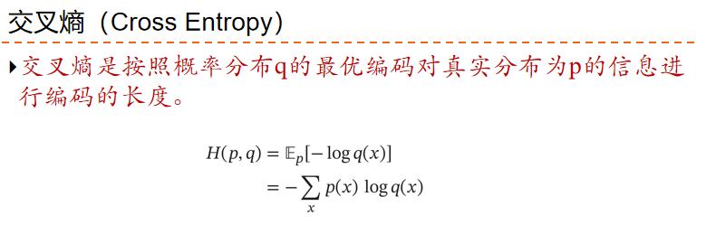

> 在给定 𝑞 的情况下，如果 p和 𝑞 越接近，交叉熵越小；
> 如果 p 和 𝑞 越远，交叉熵就越大 .

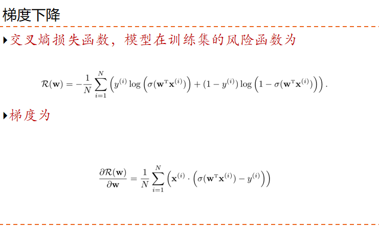

#### 多分分类问题：

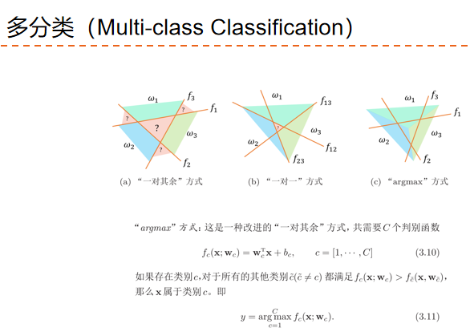

#### Softmax回归

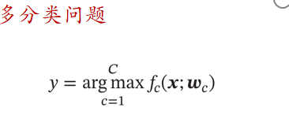

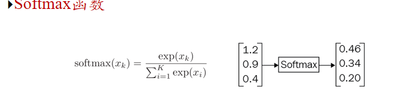

大概就是每个二分类（一对其余）的预测模型都跑一遍，取最大的

#### 感知器

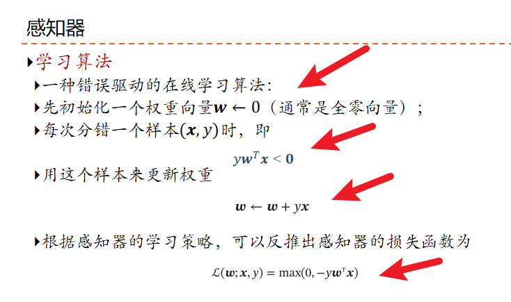

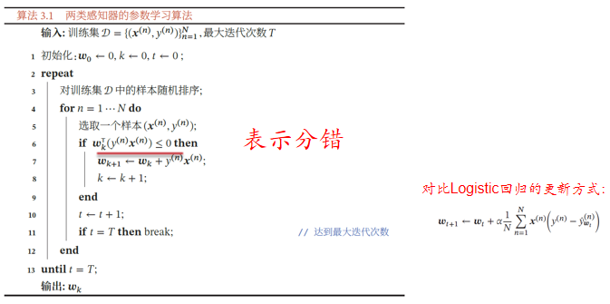

一种古老的分类问题学习算法：感知器

- 损失函数看上去不太正常，但似乎属于随机梯度优化 

- 可以收敛

#### 支持向量机

（Support Vector Machine，SVM）

==不太懂，但是感觉没啥用==

大概就是找一个模型（超平面），让边界尽量准确，不会因为噪声误判

### 线性模型小结

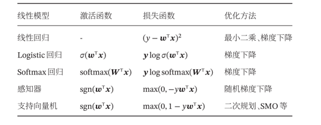

# 前馈神经网络

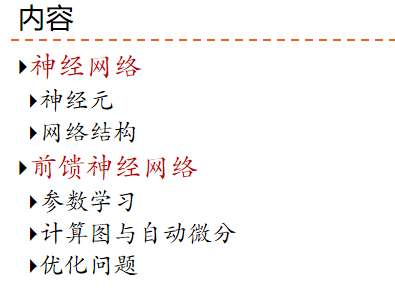

神经网络？

神经网络最早是作为一种主要的**连接主义**模型。

1）信息表示是分布式的（非局部的）； 
2）记忆和知识是**存储在单元之间的连接**上；
3）通过逐渐改变单元之间的连接强度来学习新的知识。

- 通过修改边权实现学习

##### 激活函数的性质：

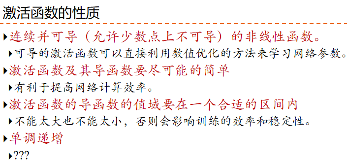

##### 常见激活函数：

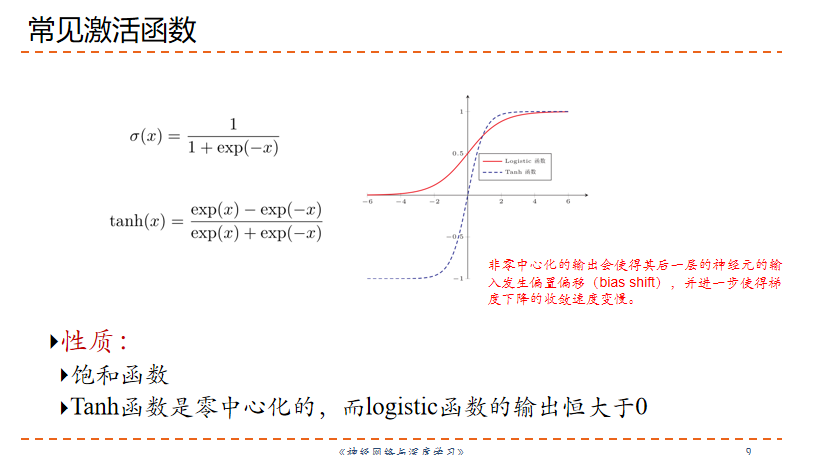

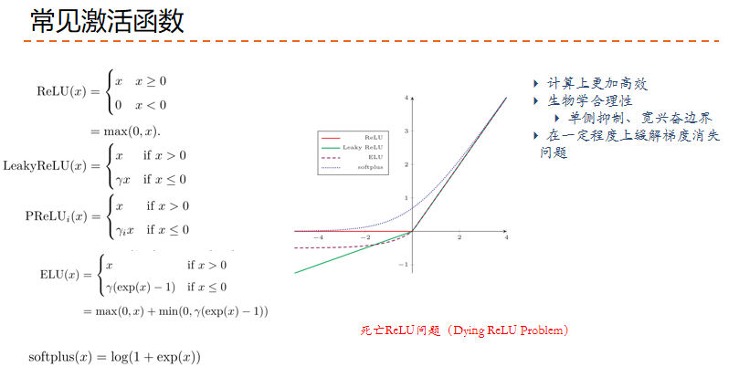

重点是relu，logistics

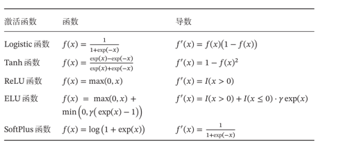

### 前馈神经网络

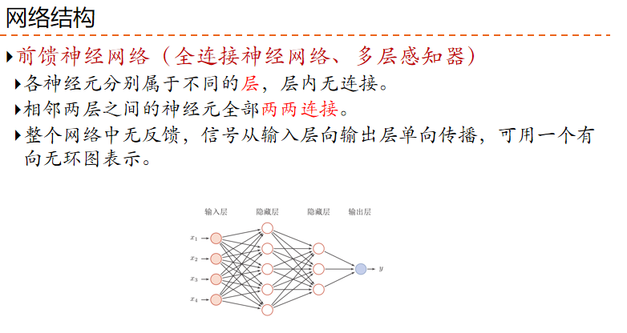

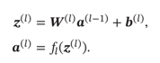

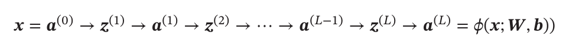

通用近似定理：

- 根据通用近似定理，对于具有**线性输出层**和**至少一个使用“挤压”性质的激活函数**的隐藏层组成的前馈神经网络，只要其隐藏层神经元的数量足够，它可以以**任意的精度**来近似任何从一个定义在**实数空间中的有界闭集函数**。

##### 应用到多分类问题

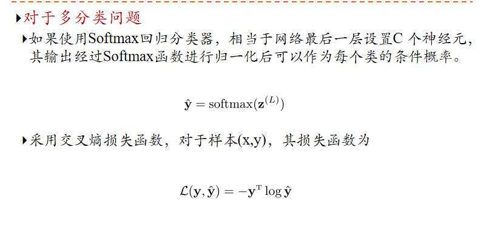

##### 如何学习？

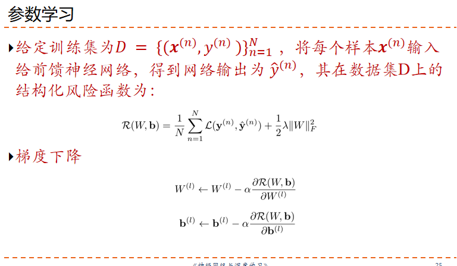

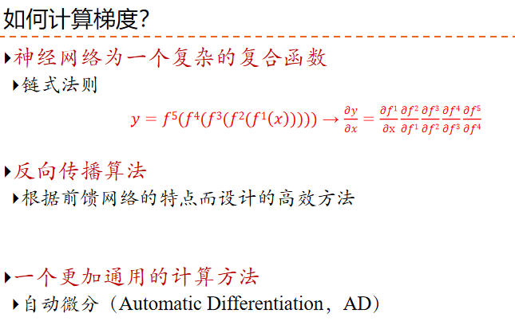

==反向传播算法+自动微分！！==

（虽然知道很重要，但是我还是不会）

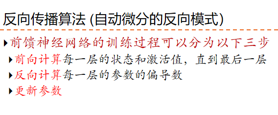

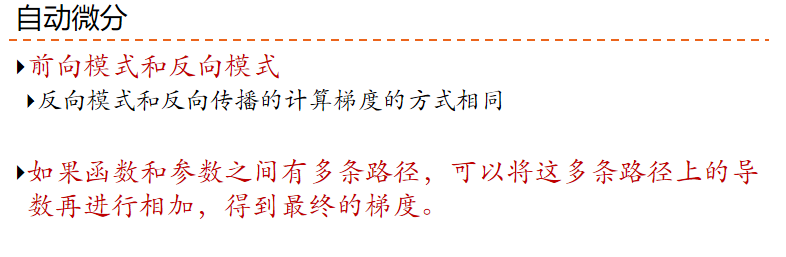

# 卷积神经网络

卷积概念

卷积核大小（n * m * ？）

有几个卷积核？

步长？填充？

通道数？

池化？（汇聚）

最后全连接

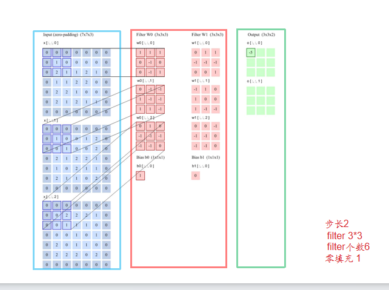

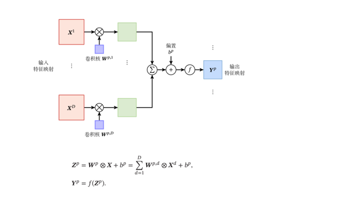

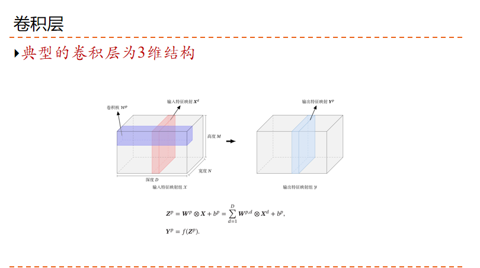

[参考：同济子豪兄](https://www.bilibili.com/video/BV1AJ411Q72b/ )

# 循环神经网

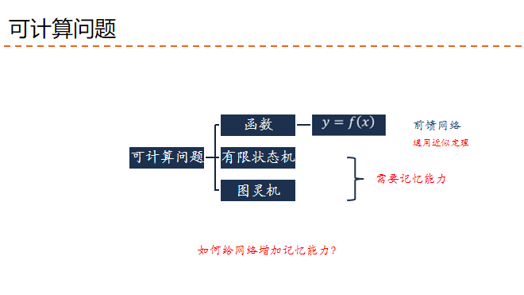

增加记忆能力？

- 可以使用自回归模型

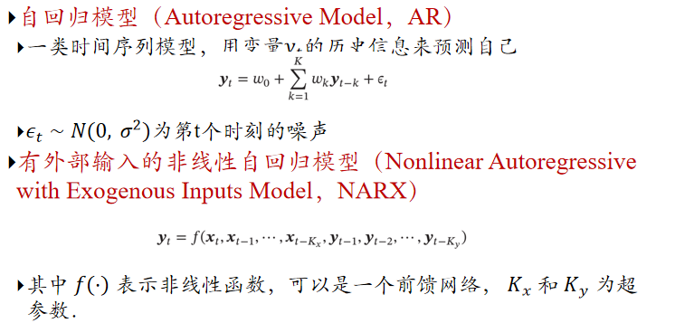

- 循环神经网络

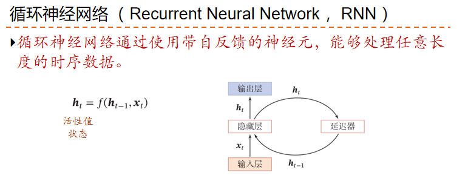

- 一个完全连接的循环神经网络可以近似解决所有的可计算问题。

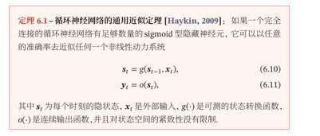

应用到机器学习

- 序列到类别

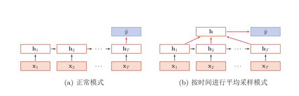

- 同步的序列到序列模式
  - 信息抽取：提取结构化信息（人，时间，地点）

- 异步的序列到序列模式

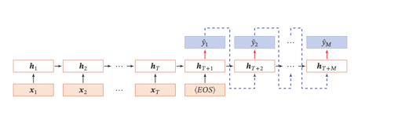

有编码（encode）和解码（decode）的过程：例如翻译

参数学习？

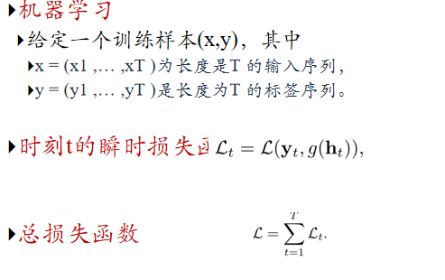

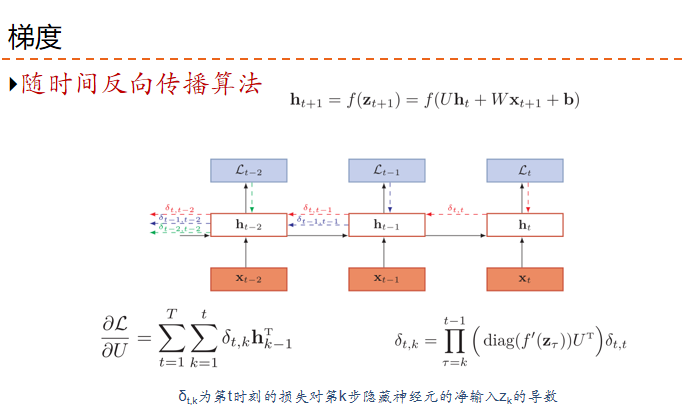

#### 长程依赖问题：

- 大概就是不能看太远

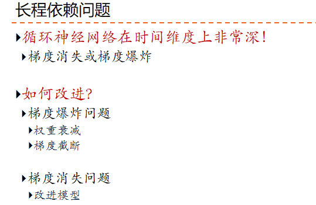

#### 引入：LSTM，GRU

[参考：李宏毅深度学习：RNN](https://www.bilibili.com/video/BV1m3411p7wD?p=28)

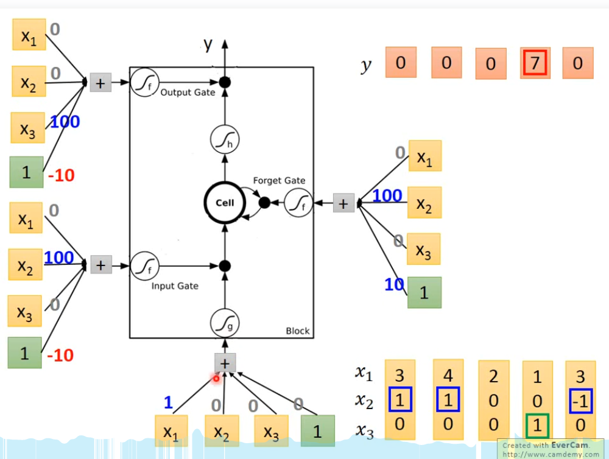

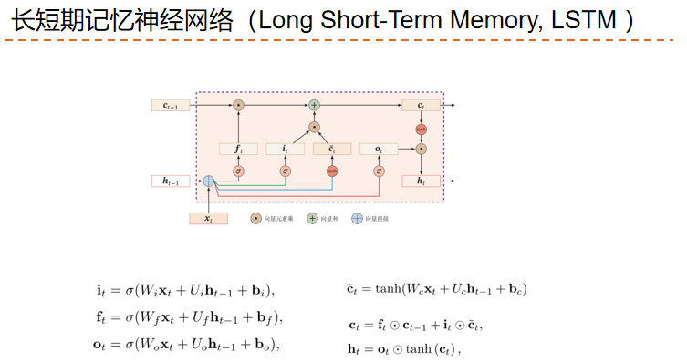

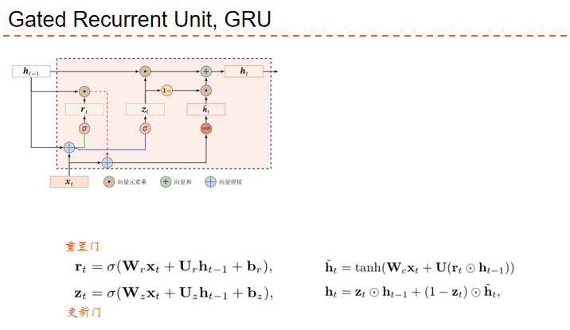

### 深层模型

堆叠循环神经网络

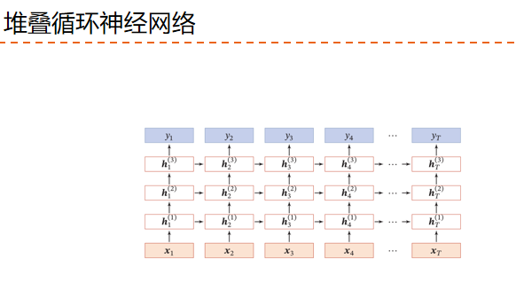

双向循环神经网络

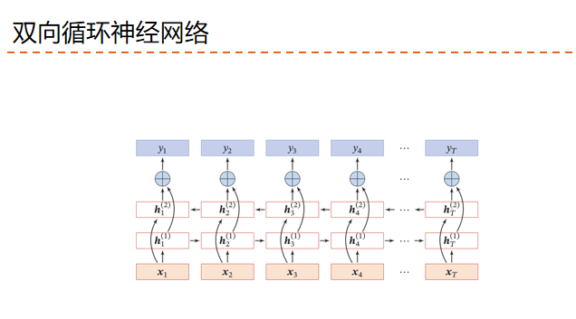

扩展到图结构（暂时觉得useless）

# 网络优化与正则化

网络优化：如何正确的修改你模型的参数

#### 网络优化难点

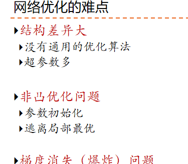

#### 网络优化方法（改善）

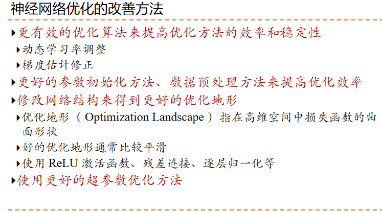

- 更好的算法（调整学习率和梯度：走正确的路）

- 更好的初始化参数：（参数初始化，数据预处理：出生点要合理）

- 修改网络结构（优化地形：让调参的路好走一些）

##### 优化算法

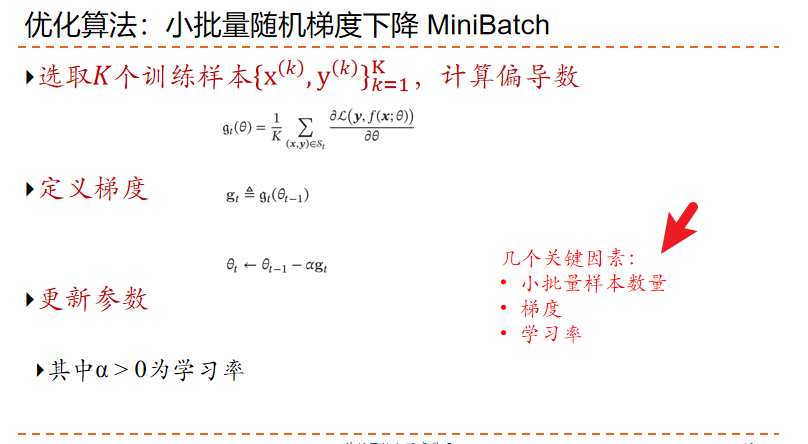

批量大小影响：

- 批量大小**不影响**随机梯度的期望，但是会**影响**随机梯度的**方差**．
  批量越大
- 随机梯度的方差越小，引入的噪声也越小，训练也越稳定，因此可以设置较大的学习率．
- 而批量较小时，需要设置较小的学习率，否则模型会不收敛．

- 总结：批量太小方向可能乱跑，所以让他少走一点，批量大的话方向是比较对的，所以可以让他多走一点

学习率and梯度：

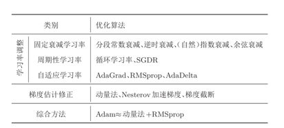

#### 初始化

参数初始化不能是0？

初始化方法

- 预训练初始化（常用）

- 随机初始化

  - Gaussian分布初始化
  - 均匀分布初始化
  - ==范数保持性== （ Norm-Preserving ）
  - 基于方差缩放的参数初始化
    - Xavier 初始化和 He 初始化
    - 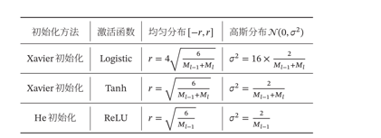
    - 正交初始化
    - 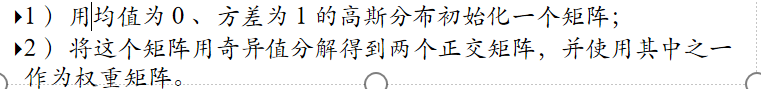

  

- 固定值初始化

  - 偏置（ Bias ）通常用 0 来初始化

- 数据预处理
- 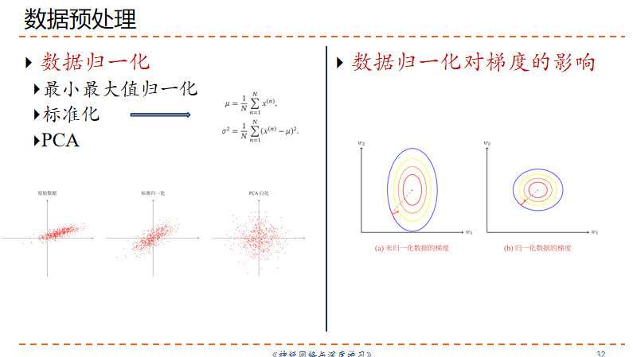

#### 逐层归一化	

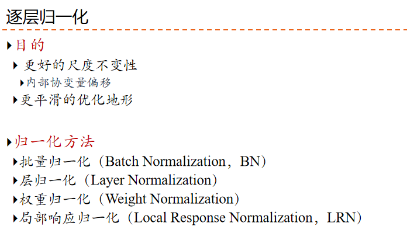

#### 归一化方法 ？？？？

批量归一化（Batch Normalization，BN）

层归一化（Layer Normalization）

权重归一化（Weight Normalization）

局部响应归一化（Local Response Normalization，LRN）

#### 超参数优化

**超参数**：（人为一开始定义的）

- 层数
- 每层神经元个数
- 激活函数
- 学习率（以及动态调整算法）
- 正则化系数
- mini-batch 大小

**优化方法**：

- 网格搜索
- 随机搜索
- 贝叶斯优化
- 动态资源分配
- 神经架构搜索

### 网络正则化

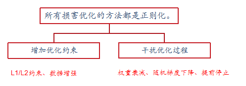

如何提高神经网络的泛化能力？

- ℓ_1和ℓ_2正则化
- early stop
- 权重衰减
- SGD
- Dropout（丢弃）
- 数据增强

### 总结

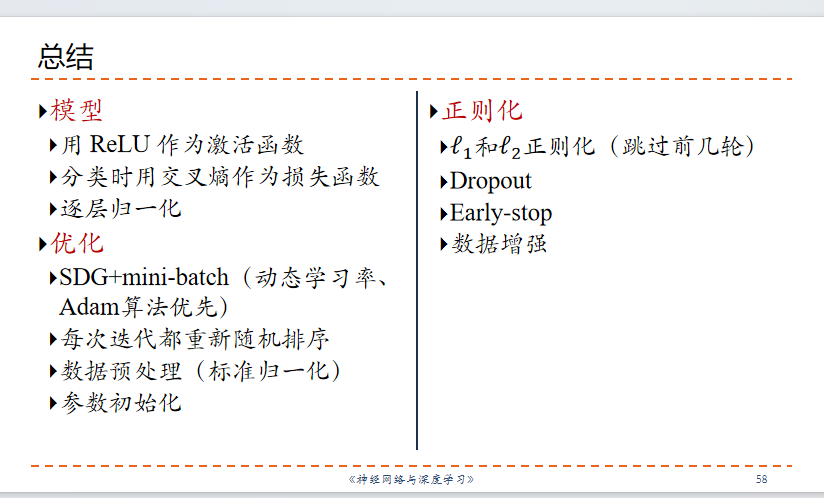

# 注意力机制

- 注意力机制
  - 指针网络
  - 自注意力模型
- 记忆增强网络
  - 结构化外部记忆
  - 基于神经动力学的联想记忆

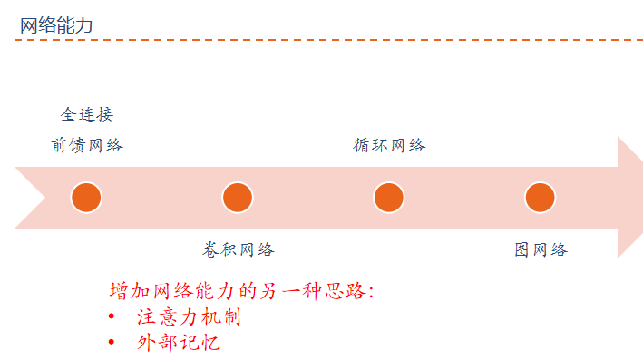

注意力机制？

[参考：李宏毅深度学习：自注意力机制](https://www.bilibili.com/video/BV1m3411p7wD?p=27)

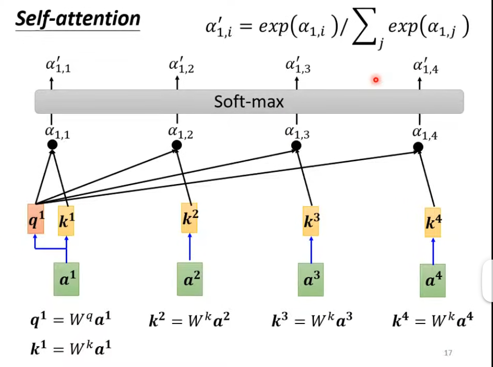