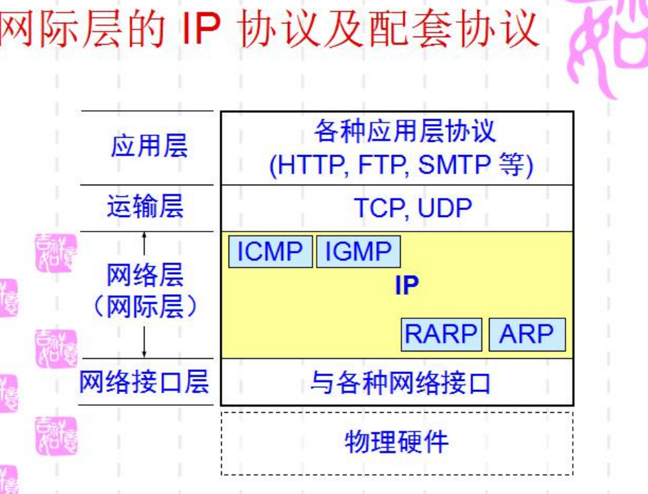

##### 1.为什么要引入 cache

​	因为 RAM 的还是太慢，赶不上 cpu 处理速度，需要各级高速缓存才能发挥处理性能

##### 2.Java 和 JavaScript 的区别：

​	Java 是一门面向对象的解释型编程语言，JavaScript 是基于对象镶嵌于 HTML 文档内的脚本语言。

##### 3.虚拟存储器和 cache 的区别：cache 是解决内存和 cpu 速度不匹配，是内部存储器，而虚拟

​	存储器一般指虚拟设备，属于外部存储设备

##### 4.IPV4 和 IPV6 的区别：

​	两种不同的 IP 协议版本 IPV6 可以使用的地址数目大大增多且更安全

##### 5.操作系统五大功能：

​	处理器管理，作业管理，存储器管理，设备管理，文件管理

##### 6.线程是不是越多越好：

​	不是，线程增多了会增加线程间切换的代价

##### 7.**html** 是什么：

​	超文本标记语言，构成网页文档的主要语言

##### 8.**UML** 是什么，有哪几类图：

​	统一建模语言，里面有五类图，用例，概念，行为，交互，实现共五类图。

##### 9.**TCP** 的作用：

​	传输控制协议，是面向**连接可靠**的，基于**字节流**的**传输层**协议，主要实现**可靠传输**。

##### 10.进程与线程的区别：

​	进程是分配资源的基本单位，线程是一个进程内的基本调度单位，进程包含一个或多个线程。

##### 11.TCP IP 公平?

##### 12.raid 是什么：

​	磁盘阵列，由许多价格便宜的磁盘组成一个容量巨大的磁盘组，利用个别磁盘提供数据所产生加成效果提升整个磁盘系统效能。

##### 13.中断和异常的区别：

​	中断指 cpu 暂停当前工作，有计划去处理其他事情可预知，处理过程事先制定，处理中断时程序正常运行 而异常 cpu 遇到无法响应的工作，而后进入一种非正常状态，异常出现表明程序有缺陷

##### 14.全局变量和局部变量的区别：

​	全局变量是整个源程序都有效的变量，而局部变量会在其所属的函数或循环结束后消亡

##### 15.icmp 位于哪一层，有什么作用：

​	位于网络层，用于 IP 主机路由器间传递控制信息

##### 16.一个比内存大的程序能否运行：

​	能，使用虚拟内存

##### 17.SRAM 与 DRAM 的区别：

​	SRAM 是一种具有静止存取功能的内存，不需要刷新电路即能保存它的内部存储数据，速度快。 

​	DRAM 是动态随机存储器，只能将数据保存很短时间。

##### 18.虚拟内存是什么，它的实质是什么?

##### 19.网络安全技术有哪些：

​	虚拟网技术，防火墙技术，病毒防护技术，入侵检测技术，安全扫描技术，认证和数字签名技术，VPN，应用系统安全技术

##### 20.为什么主存是动态的而缓存是静态的：

##### 21.TCP IP 有哪几层：

​	**应用层，网络层，传输层，链路层。**

​	TCP/IP，全称为传输控制协议/互联网协议，是互联网上使用的主要通信协议。它定义了计算机如何在网络中**发送和接收数据**的标准规则。TCP/IP是一个**协议栈**，包含一系列用于不同网络通信层次的协议。这个模型通常被描述为分层体系结构，包括以下四个层次：

​	1. 链路层（网络接入层）

- **功能**：处理与物理网络介质的连接，负责在两个直接连接的节点之间传输数据。
- **技术实例**：以太网、Wi-Fi。

2. 网络层（互联网层）

- **功能**：处理数据包在网络中的路由和转发。
- **核心协议**：互联网协议（IP），它负责将数据包从源主机传输到目标主机，通过一个或多个路由器。

3. 传输层

- **功能**：为两台主机上的应用程序提供端到端的数据传输。
- 核心协议：
  - 传输控制协议（TCP）：提供可靠的、有序的、基于连接的数据传输服务，确保数据完整性。
  - 用户数据报协议（UDP）：提供无连接的传输服务，速度快但不保证数据包的顺序或完整性。

4. 应用层

- **功能**：为应用软件提供网络服务。
- **协议实例**：超文本传输协议（HTTP）、简单邮件传输协议（SMTP）、文件传输协议（FTP）等。

5. 重要协议：TCP，UDP，ICMP，IP

##### 22.网络地址变换协议是什么：

##### 23.触发器是什么，说出四种触发器:

​		

##### 24.类的继承方式(JAVA)

##### 25.**软件工程模型：**

瀑布模型

V过程模型

原型实现模型

快速应用开发（RAD）

增量模型

螺旋模型

极限编程（XP）

##### 26.面向对象三大特征

##### 27.CPU有几种寄存器，CPU的组成：

32位CPU所含有的寄存器有：

4个**数据寄存器**(EAX、EBX、ECX和EDX)

2个**变址和指针寄存器**(ESI和EDI)

2个**指针寄存器**(ESP和EBP)

6个**段寄存器**(ES、CS、SS、DS、FS和GS)

1个**指令指针寄存器**(EIP)

1个**标志寄存器**(EFlags) 

##### 28.解释执行与编译执行的区别

##### 29.大数据的了解？以及英文缩写？

​	大数据(big data,mega data)，或称巨量资料，指的是需要新处理模式才能具有更强的决策

力、洞察力和流程优化能力的海量、高增长率和多样化的信息资产。

大数据的 4V 特点:Volume(大量)、Velocity(高速)、Variety(多样)、Value(价值)。它的特

色在于对海量数据的挖掘，但它必须依托云计算的分布式处理、分布式数据库、云存储和/

或虚拟化技术

##### 30.总线和接口的区别？

​	总线是一组传输通道，比如说 PCI 总线。

​	接口是一种连接标准，比如说 PCI 接口

##### 31.生成树在网络中有什么应用？

##### 32.套接字用的什么协议?

##### 33.数组和链表的区别？

##### 34.cache 是什麽？解决了什么问题？

##### 35.为什么引入 cache？

##### 36.外围设备

​	计算机系统中除主机外的其他设备。包括输入和输出设备、外存储器、模数转换器、数模转

换器、外围处理机等。是计算机与外界进行通信的工具。 - 例如打印机、磁盘驱动器或键盘

##### 37.**什么是计算机病毒？计算机病毒有哪些分类**？

- 按破坏性分

- 按连接方式分

##### 38.**UML** 是什么？**主要包括哪几类图**？

##### 39.活动图，时序图，状态图的区别

##### 40.io 操作有哪些？

##### 41.Get 方法与 Post 方法的区别？

##### 42.**IPV4** **与** **IPV6** 的区别？

##### 43.**http** **与** **https** **的区别？**

##### 44.什么是 Cookie？Cookie 与 Session 的区别？

##### 45.拥塞处理的手段？慢开始算法、拥塞避免算法、快速重传算法、快速恢复算法

##### 46.**堆分配和栈分配的区别**？

##### 47.**什么是操作系统？操作系统的功能有哪些？**

##### 48.什么是内核？

##### 49.**什么是系统调用？**

##### 50.进程在内核态和用户态的区别？

##### 51.**进程的状态**：

##### 52.**进程与线程的区别**？

##### 53.线程是不是越多越好？

##### 54.**MySQL** **事务的四大特性**：

##### 55.什么是数据库连接池?为什么需要数据库连接池呢?

##### 56.为什么要使用视图？什么是视图？

##### 57.**TCP** **与** **UDP** **的区别**？

##### 58.**TCP/IP** **协议的分层**：

##### 59.**TCP** **的三次握手、四次挥手**

https://blog.csdn.net/m0_38106923/article/details/108292454

##### 60.在浏览器输入 URL 到显示主页的过程是什么？

##### 61.**IP** **地址的分类**：

​	A 类地址：1.0.0.0——126.255.255.255

​	B 类地址：128.0.0.0——191.255.255.255

​	C 类地址：192.0.0.0——223.255.255.255

##### 62.**IP** **地址与子网掩码相与得到主机号**

##### 63.**什么是子网掩码**？

##### 64.**DNS** **是什么**？

##### 65.DOS 是什么？

​	此处建议观看以下视频 https://www.bilibili.com/video/BV1KQ4y117nq

##### 66.什么是软件危机？软件危机有什么表现？

##### 67.什么是敏捷开发？

##### 68.什么是极限编程？

##### 69.**白盒测试、黑盒测试的区别**？

##### 70.α**测试和**β**测试的区别**？

##### 71.**什么是** **Socket**？

##### 72.什么是虚拟主机？

##### 73.MySQL 的索引及其实现方式？

##### 74.什么是 SQL 注入（SQL injection）？如何防止 SQL 注入？

##### 75.什么是幻读？MySQL 如何防止幻读？

##### 76.什么是最左匹配原则？

##### 77.**什么是** **NoSQL**

##### 78.安卓系统和 IOS 系统的区别？

##### 79.什么是云计算？

##### 80.软件有哪些设计模式？

##### 81.监督学习与非监督学习的区别？

##### 82.**数据库系统与文件系统的区别**？

##### 83.什么是非对称加密？

##### 84.计算机怎么区别指令和数据？

85.**程序编译主要有哪几个过程**？

86.DFA 与 NFA 的区别？

87..c 文件是怎么执行的？

88.**指针和引用的区别**？

89.**什么是** **MVC****？**

90.软件体系结构有哪些？

91.简单介绍一下管程。

92.什么是摩尔定律？

93.

94.

95.

96.

97.

98.

99.

100.

101.

102.

103.

104.

105.

106.

107.

108.

109.

110.

111.

112.

113.

114.

115.

116.

117.

118.

119.

120.

121.

122.

123.

124.

125.

126.

127.

128.

129.

130.

131.

132.

133.

134.

135.

136.

137.

138.

139.

140.

141.

142.

143.

144.

145.

146.

147.

148.

149.

150.

151.

152.

153.

154.

155.

156.

157.

158.

159.

160.

161.

162.

163.

164.

165.

166.

167.

168.

169.

170.

171.

172.

173.

174.

175.

176.

177.

178.

179.

180.

181.

182.

183.

184.

185.

186.

187.

188.

189.

190.

191.

192.

193.

194.

195.

196.

197.

198.

199.

200.

