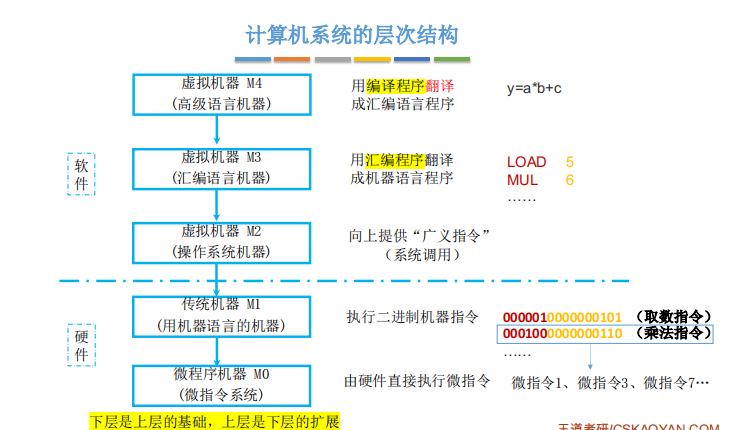

# 计算机系统概述

（一）计算机发展

- 电子管
- 晶体管
- 中小规模集成电路
- 超大规模集成电路

（二）计算机系统层次结构

1. 计算机系统=软件+硬件
2. 硬件：
   - 冯基本思想
     - 存储程序
     - 运算器，存储器，控制器，输入设备，输出设备
     - 指令数据都在存储器，用二进制表达 指令=操作码+地址码
   - 功能部件
3. 软件
   1. 系统软件，应用软件
   2. 高级语言，汇编语言，高级语言
   3. 软硬逻辑等价
4. 计算机层次结构

5. 计算机系统工作原理
   1. 存储程序：
      1. 取指
      2. 译码
      3. 执行
   2. 源程序到可执行（.c）
      1. 预处理 （.i） （#include）
      2. 编译（.s）（编译器）
      3. 汇编（.o）（汇编器，已经是二进制了，可重定位文件）
      4. 链接（.exe?）（合并标准库函数，可执行）

（三）计算机的性能指标

1. 字长
2. 数据通路带宽
3. 主存容量
4. 运算速度
   1. 吞吐量
   2. 响应时间
   3. 主频，CPU时钟周期
   4. CPI ：一条指令的平均时钟周期数
   5. CPU执行一个程序时间
   6. MIPS：每秒执行多少百万条指令
5. 基准程序

6. 专业术语
   1. 系列机
   2. 兼容
   3. 软件可移植
   4. 固件（ROM中的os）：把程序固化在ROM中